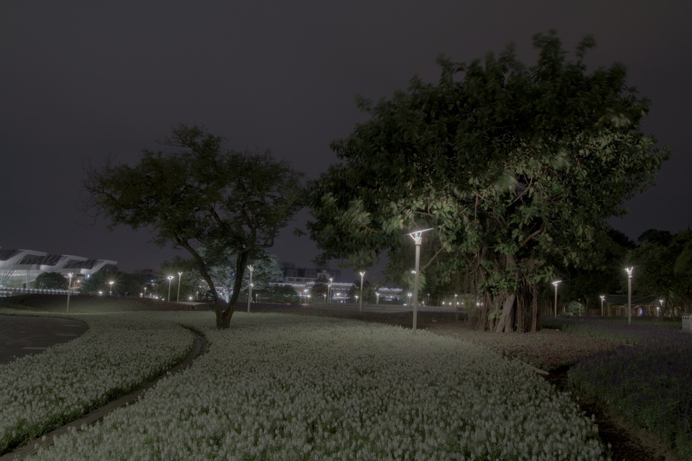
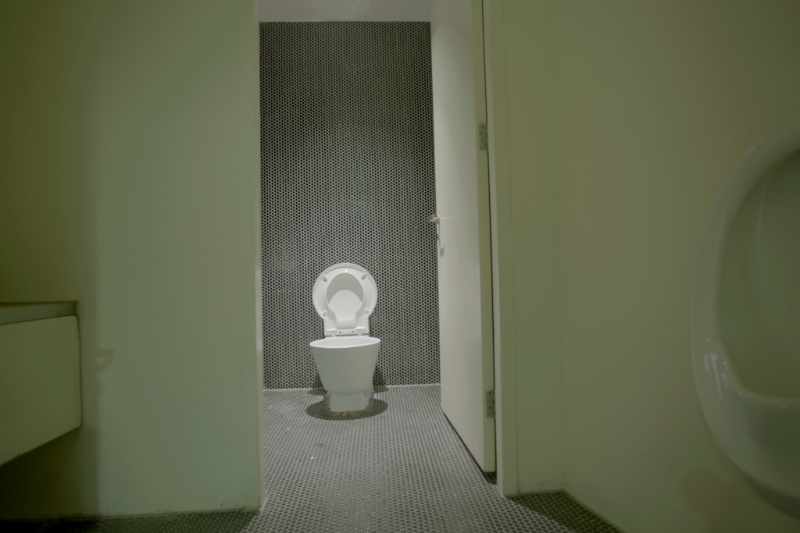
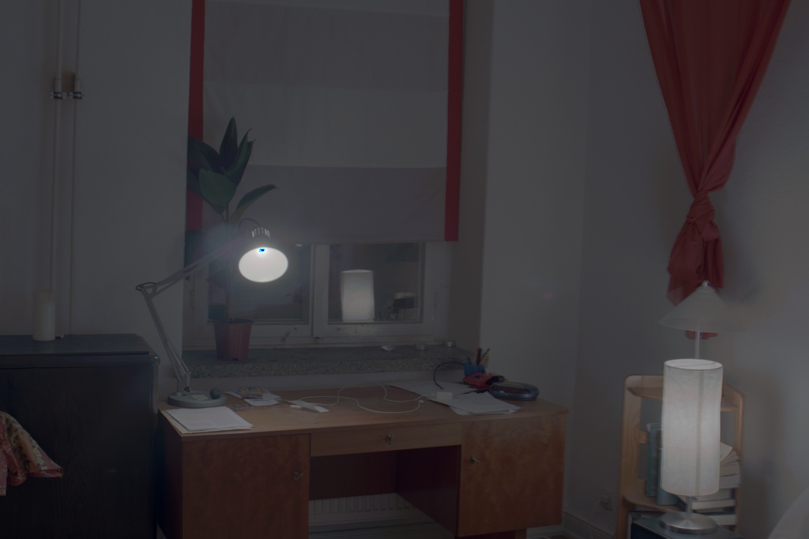
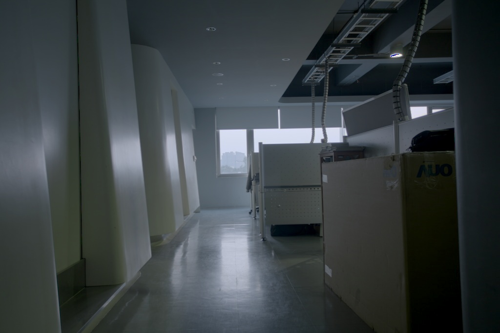
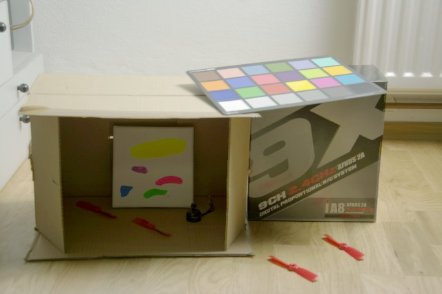

# HDR

Work from [paper](http://citeseerx.ist.psu.edu/viewdoc/download?doi=10.1.1.463.6496&rep=rep1&type=pdf).

## Prerequisites

### Windows

- Install [CMake](https://cmake.org/download/). We recommend to add CMake to path for easier console using.
- Install [opencv 2.4](https://github.com/opencv/opencv) from sources.
    - Get OpenCV [(github)](https://github.com/opencv/opencv) and put in on C:/ (It can be installed somewhere else, but it's recommended to be close to root dir to avoid too long path error). `git clone https://github.com/opencv/opencv`
    - Checkout on 2.4 branch `git checkout 2.4`.
    - Make build directory .
    - In build directory create project with cmake or cmake-gui (enable `BUILD_EXAMPLES` for later test).
    - Open project in Visual Studio.
    - Build Debug and Release versions.
    - Build `INSTALL` project.
    - Add `opencv_dir/build/bin/Release` and `opencv_dir/build/bin/Debug` to PATH variable. 
    - Test installation by running examples in `opencv/build/install/` dir.

## Installing
```
git clone https://github.com/nejcgalof/HDR.git
```

## Build
You can use cmake-gui or write similar like this:
```
mkdir build
cd build
cmake -G "Visual Studio 14 2015 Win64" -DOpenCV_DIR="C:/opencv/build" ..
```

## Usage

```
HDR.exe folder
```

## Results

Scene


Digimax_gate


Desktop01


Desktop02


Restroom


Pics_window


Corridor


Exp_brack_1_jpg


My_hdr_img <br />
